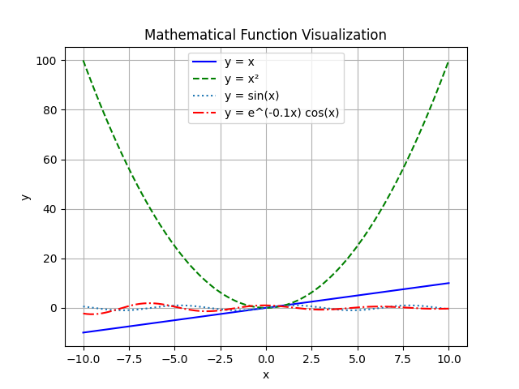
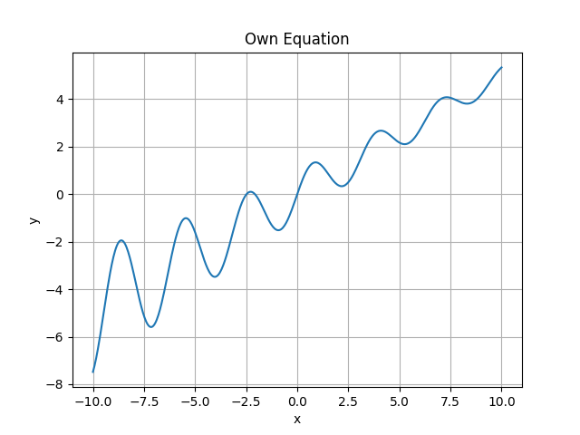
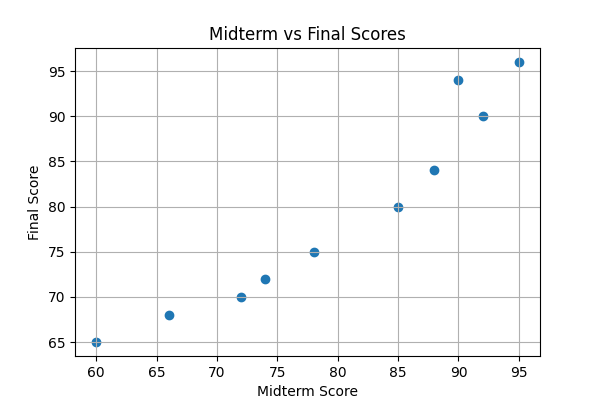
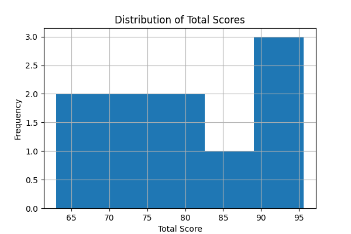
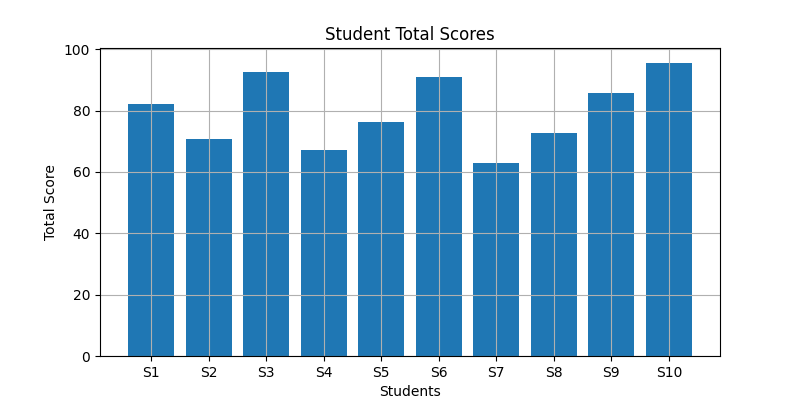
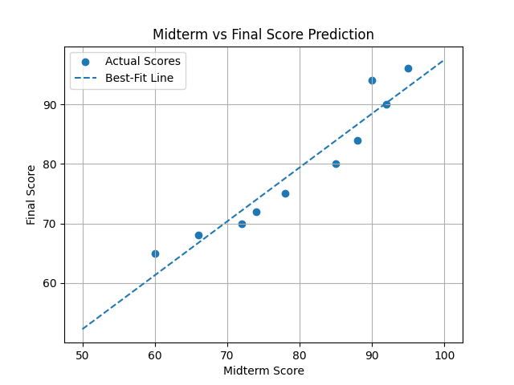

# Math Visualization Assignment

## Project Description

This project demonstrates mathematical function visualization and student score data analysis using Python, NumPy, and Matplotlib.

The assignment includes:
- Mathematical function plotting
- Custom equation visualization
- Student score analysis
- Scatter plots, histograms, and bar charts
- Best-fit line prediction using linear regression

---

## Libraries Used

- NumPy
- Matplotlib

---

## How to Run the Code

### Option 1: Google Colab

1. Go to Google Colab
2. Upload the .ipynb file from this repository
3. Open the notebook
4. Click Run All

### Option 2: Jupyter Notebook

1. Install Jupyter:
   pip install notebook
2. Run:
   jupyter notebook
3. Open the `.ipynb` file and run all cells

### Option 3: Visual Studio Code

1. Open the project folder in VS Code
2. Install the Python extension (if not already installed)
3. Open main.ipynb file
4. Click Run or Run All

---
## Generated Graphs

### Task 1:

### Task 2:

### Task 3: Student Score Data Visualization

### Task 4: Simple Prediction

## Explanation

### How does visualization help us understand mathematical functions and data?

Visualization makes complex mathematical relationships easier to understand. For example, graphs help us quickly identify patterns, trends, growth, and relationships between variables.

### Which plot was most useful in this assignment and why?

The best-fit line prediction plot was the most useful because it showed the relationship between midterm and final scores clearly and allowed simple prediction of future values.

### What is the role of NumPy and Matplotlib in your project?

NumPy was used for numerical calculations and generating data arrays efficiently. Matplotlib was used to create all graphs and visualizations.

---
## Open-Source Licensing & Attributions
This project leverages open-source software libraries. In compliance with software transparency standards, the third-party components used are acknowledged below:

* **NumPy**: Licensed under the BSD 3-Clause "New" or "Revised" License. Copyright (c) 2005-2026, NumPy Developers.
* **Matplotlib**: Licensed under the Matplotlib License Agreement (BSD-compatible). Copyright (c) 2002-2026, Matplotlib Development Team.
